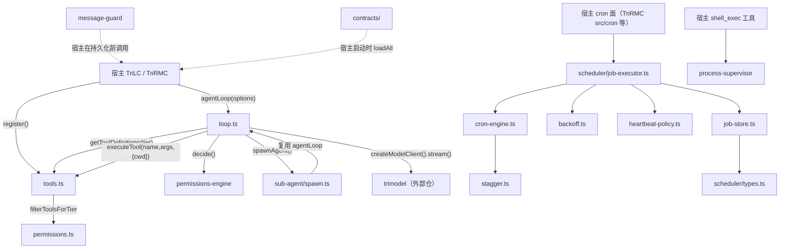

# 04 代码复刻版：agent-core v0.1.0 详细代码逻辑研究

## 文档同步元信息

- sourceOfTruth: TriTraining/cc-tutorial/agent-core-v0.1.0/04-代码复刻版.md（代码论断真源 = TriCompany/packages/agent-core/src/）
- syncMode: source-derived
- lastSyncedAt: 2026-08-25
- tutorialVersion: agent-core-v0.1.0

> 本文自包含：不读前三版也能通读。所有代码片段均为真实源码摘录，标注 `文件路径:行号`，行号对应 agent-core v0.1.0 快照。

## 0. 本版目标与读法

**目标**：读完本文，你能不看原仓库、自己动手写出一个功能对等的 agent 内核骨架——一个带错误恢复的 agent 循环、一套注册表式工具系统、一层十步决策权限引擎、一个 JSON 原子持久化的 cron 调度核、一份严格合同校验器和一组宿主侧支撑件。

**讲法**：按"先跑通最小 MVP → 再逐层加复杂度"展开（§1 到 §12）。每一层都回答同一个问题：这一层解决了上一版的什么问题？

**前置**：TypeScript 异步迭代器（`AsyncGenerator`）、zod 基础、Node child_process 基础。

---

## 1. 全局地图：这个包里到底有什么

```
TriCompany/packages/agent-core/
├── package.json          # @tricompany/agent-core 0.1.0，ESM，deps: croner / trimodel(file:) / yaml / zod
├── tsconfig.json         # ES2022 + NodeNext + strict + noUncheckedIndexedAccess
├── src/
│   ├── index.ts          # 总出口 barrel（全部公共 API 从这里出）
│   ├── loop.ts           # ① agent 循环（核心中的核心）
│   ├── tools.ts          # ② 工具注册表（只有注册表，零内建工具）
│   ├── permissions.ts    # ③ tier 层级工具准入
│   ├── permissions-engine/  # ④ 权限引擎（模式/规则/十步管线/安全检查）
│   ├── contracts/        # ⑤ 员工合同 v3 schema + 解析器
│   ├── message-guard/    # ⑥ 空头消息守卫
│   ├── process-supervisor/  # ⑦ 子进程监督器 + 运行记录表
│   ├── scheduler/        # ⑧ cron 调度核（引擎/存储/执行器/退避/心跳）
│   └── sub-agent/        # ⑨ 子代理生成与事件适配
└── test/                 # node:test 测试（测 dist 产物）+ 合同 fixtures
```

依赖方向是严格的单向星形：所有模块只向内依赖 `trimodel` 的类型和彼此，宿主（TriLC / TriMC / TriRMC）只从 `index.ts` 导入。`package.json:19-24` 声明四个运行时依赖：`croner ^10.0.1`（cron 表达式）、`trimodel file:../../../TriModel`（模型客户端抽象）、`yaml ^2.6.0`、`zod ^3.23.0`。

**与"七大件"术语的关系**：迁移蓝图（`TriRMC/MIGRATION.md:14`）列的七件种子资产是 agent-loop / cron / contracts / onboarding / config-sync / observability / comm——那是 TriMC 服务域的模块划分口径。其中三件的核心逻辑就落在 agent-core 里（agent-loop=①②③④⑦⑨，cron=⑧，contracts=⑤），另外四件（onboarding/config-sync/observability/comm）是宿主侧服务目录（见 TriRMC `src/onboarding/`、`src/config-sync/` 等），它们消费 agent-core 的原语来组装。教程统一按源码实况讲这九个区。

---

## 2. 最小 MVP：一个能转起来的 agent 循环

任何 agent 内核的最小闭环都是同一句话：

```
准备消息数组 → 调模型 → 模型要么给文本（结束），要么给 tool_calls（执行后把结果追加进数组再调模型）→ 直到没有工具调用或超过轮数上限。
```

agent-core 把它写成唯一的主函数 `agentLoop`（`src/loop.ts:292`），签名是一个 **async generator**：

```ts
// loop.ts:292-300
export async function* agentLoop(options: AgentLoopOptions): AsyncGenerator<AgentEvent> {
  const model = options.model ?? 'deepseek-v4-pro';
  const fallbackModel = options.fallbackModel ?? getFallbackModel(model);
  const maxTurns = options.maxTurns ?? 25;
  const tier = options.tier ?? 'main';
  const deps = options.deps ?? {};
  const modelClient = createModelClient();
```

设计要点一：**用 generator 而不是回调**。每发生一件事（开始请求/吐字/工具调用/结束）就 `yield` 一个事件对象，宿主自己决定怎么消费——TriLC 把它转成 SSE 推给前端（`TriLC/src/server/app.ts:1909`），也可以像 `runAgentLoop` 那样攒成数组（`loop.ts:667-687`）。

设计要点二：**不可变状态（spread-replace）**。循环状态不用 `state.messages.push(...)`，而是每次整体替换：

```ts
// loop.ts:483-486
state = {
  ...state,
  messages: [...state.messages, assistantMsg],
};
```

收益：状态变化可比较、可快照，出问题时打印任意时刻的 `state` 就是完整现场；也避免同一数组被多处持有导致的隐式共享变更。

设计要点三：**默认值即安全底线的选择权在宿主**。注意 `loop.ts:295` 默认最多 25 轮防失控；但默认模型是 `deepseek-v4-pro`（`:293`）、默认权限模式是 `bypassPermissions`（`:340`）——这两条意味着"裸调 agentLoop 不传参 = 全放开"。宿主必须显式传权限配置（见 §7 已知缺口第 1 条）。

MVP 主循环骨架（去掉恢复/缓存等增强后的形状，对照真实代码 `loop.ts:366-662`）：

```text
while (true) {
  signal 已中止？→ loop_end(aborted)，返回            // loop.ts:368-371
  turnCount > maxTurns？→ loop_end(max_turns)，返回   // loop.ts:374-377
  response = streamChat(model, messages)              // 调模型，边流边 yield content_delta
  messages += assistant 消息                          // loop.ts:476-486
  没有 tool_calls？→ loop_end(done)，返回             // loop.ts:489-497
  对每个 tool_call：发事件 → 权限检查 → 执行 → 收集 tool 结果消息
  messages += toolResults; turnCount++                // loop.ts:655-661
}
```

**复刻清单第 1 步**：先写出上面这个 while 循环 + 一个假的 `streamChat`，能对着 echo 模型转起来，后面的每一节都是在往这个骨架上挂东西。

---

## 3. streamChat：流式响应与三家格式的工具调用拼接

`streamChat`（`loop.ts:233-288`）把模型的流事件折叠成一个完整的 `ChatResponse`。文本部分简单累加；难点在 **tool_calls 的增量拼接**——不同供应商的流式协议不一样：

```ts
// loop.ts:251-264
if (event.tool_calls) {
  for (const tc of event.tool_calls) {
    const existing = toolCallMap.get(tc.index) ?? { id: '', name: '', arguments: '' };
    if (tc.id) existing.id = tc.id;
    if (tc.function?.name && existing.name !== tc.function.name) existing.name += tc.function.name;
    if (tc.function?.arguments) {
      const incoming = tc.function.arguments;
      if (incoming.startsWith(existing.arguments)) {
        existing.arguments = incoming; // cumulative snapshot (DeepSeek repeat / Anthropic accumulator)
      } else {
        existing.arguments += incoming; // incremental fragment (OpenAI standard)
      }
    }
    toolCallMap.set(tc.index, existing);
  }
}
```

逐段解释：

1. 以 `tc.index` 为键聚合——同一次回复里的多个工具调用靠下标区分。
2. 参数字符串做**双协议兼容**：如果新片段以已累计内容为前缀，说明上游发的是"全量快照"（DeepSeek 会重复发整个字符串、Anthropic 是累积器语义），直接覆盖；否则当作 OpenAI 式的增量碎片，做追加。判断错协议会导致参数变成 `"{"{"{a..."` 这种坏 JSON。
3. 函数名用 `existing.name !== tc.function.name` 判断后追加，避免同名分片重复。
4. 结束时按下标排序还原成数组（`loop.ts:272-278`），usage 缺省补零值结构（`:286`）。

**为什么这值得单独一节**：复刻时最常见的 bug 就是这里——只实现了一种协议，换模型就解析出损坏的工具参数。

---

## 4. 错误分类与两层恢复级联

### 4.1 classifyError：正则分类四类错误

```ts
// loop.ts:176-182
function classifyError(err: unknown): 'transient' | 'context_overflow' | 'auth' | 'permanent' {
  const msg = (err instanceof Error ? err.message : String(err)).toLowerCase();
  if (/timeout|abort|econnreset|econnrefused|5\d\d|rate.?limit|overloaded|network/i.test(msg)) return 'transient';
  if (/413|context.?length|prompt.?too.?long|token.?limit|maximum.*context/i.test(msg)) return 'context_overflow';
  if (/401|403|unauthorized|invalid.*key|auth/i.test(msg)) return 'auth';
  return 'permanent';
}
```

这是**对错误消息文本做正则匹配**的启发式分类，不是 HTTP 状态码分类（因为异常可能来自各层包装）。复刻时注意正则顺序：transient 先判，避免 `503 rate limit` 这类同时命中多条的消息被误归 auth。

### 4.2 两层回退 + 三档恢复

架构注释在 `loop.ts:184-205`：第一层在 TriModel 客户端内部（provider 级链式回退，如 tmv-deepseek-v4-pro → tmv-deepseek-chat）；第二层才是这里的**模型级终极回退表**：

```ts
// loop.ts:207-220（节选）
const FALLBACK_MAP: Record<string, string> = {
  'deepseek-v4-pro': 'deepseek-v4-flash',
  ...
  'tmv-deepseek-v4-pro': 'tmv-deepseek-v4-flash',
  'tmv-deepseek-v4-flash': 'tmv-deepseek-v4-pro',
};
function getFallbackModel(model: string): string {          // loop.ts:227-229
  return FALLBACK_MAP[model] ?? 'deepseek-v4-flash';
}
```

历史上 tmv 条目曾直接指向 `deepseek-v4-*` 直连名，导致纯 tmv 部署的 Tier 2 恢复必然报 "Model not in registry"，2026-08-13 修复为 tmv 域内降档（`loop.ts:195-201` 注释）。教训：**回退目标必须在目标部署的注册表里真实存在**。

运行时恢复分三档（`loop.ts:396-456`）：

| 档 | 触发 | 动作 |
| --- | --- | --- |
| 直接终止 | `auth` / `context_overflow` | 发 `error` 事件 + `loop_end(error)` 返回——重试没意义 |
| Tier 1 | `transient` | 同模型立即重试一次（`:406-427`） |
| Tier 2 | 重试仍失败且未试过回退 | 切到 FALLBACK_MAP 目标重试（`:429-449`），`hasAttemptedFallback` 保证只切一次 |
| Tier 3 | 全部耗尽 | 报错收场（`:451-456`） |

每档恢复都会 yield 一个 `recovery` 事件（tier: 1 或 2），宿主 UI 可以据此提示"模型抖动重试中/切换备援模型"。回合结束时 `transition` 字段记录本轮原因：`model_hiccup` / `model_swap` / `next_turn`（`loop.ts:660`）。

---

## 5. 工具系统：纯注册表，零内建

`src/tools.ts` 整个文件只有一个模块级 `Map` 和六个函数（`tools.ts:29`）：

```ts
// tools.ts:37-42
export function register(def: ToolDefinition, handler: ToolHandler): void {
  if (toolRegistry.has(def.function.name)) {
    console.warn(`[agent-core] Tool "${def.function.name}" is being overwritten`);
  }
  toolRegistry.set(def.function.name, { definition: def, handler });
}

// tools.ts:61-71
export async function executeTool(name, args, ctx?): Promise<string> {
  const tool = toolRegistry.get(name);
  if (!tool) throw new Error(`Unknown tool: ${name}`);
  return tool.handler(args, ctx);
}
```

关键取舍：

- **内核不含 read_file/shell_exec 等任何具体工具**（文件头 `tools.ts:1-6` 明说 registry-only）。谁消费谁注册：TriLC 在 daemon 启动时注册 shell_exec（`app.ts:990` `registerShellExecTool(...)`），`/v1/messages` 收到的请求自带工具定义时也直接注册占位 handler（`app.ts:1856-1863`，真实执行委托给 TriPilot 客户端回环）。
- handler 统一签名 `(args, ctx?) => Promise<string>`，返回 **JSON 字符串**；`ctx.cwd` 承载 REQ-014b 口径——工具拿到的是 agent 循环的工作目录而不是 `process.cwd()`（`tools.ts:13-17`）。
- `unregister` 单独存在是为了 C10：MCP 服务器断开时逐工具清理（`tools.ts:89-93` 注释）。
- 注册表是**进程级全局单例**。同一进程跑两个不同工具集的循环会互相污染——复刻时要意识到这是有意的简化，多租户场景需要改成实例化注册表。

---

## 6. 双闸门权限体系

agent-core 有两套互相独立的权限机制，执行顺序是"权限引擎在前、tier 闸门在后"（`loop.ts:518` 先查引擎，`loop.ts:566-582` 再查 tier）。

### 6.1 tier 层级：数字比大小的准入

`src/permissions.ts` 定义四个层级，数值越小权力越小：

```ts
// permissions.ts:28-33
const TIER_LEVEL: Record<AgentTier, number> = {
  coordinator: 0, subagent: 1, heartbeat: 2, main: 3,
};

// permissions.ts:35-55（节选）
export const TOOL_TIER_ALLOWLIST: Record<string, AgentTier> = {
  read_file: 'subagent', list_directory: 'subagent', search_code: 'subagent', ...
  task: 'coordinator',
  write_file: 'heartbeat', edit_file: 'heartbeat', replace_in_file: 'heartbeat',
  shell_exec: 'main',
};
```

判定逻辑一行：所需最低层级的数值 ≤ 当前层级的数值即放行（`permissions.ts:110`）。未登记的工具一律要求 main（`permissions.ts:109` `?? 'main'`，fail-closed）。两条特例要记住：

- **反递归守卫**：subagent 一律不许用 `task` 工具再生子代理，优先于数值比较（`permissions.ts:101-107`）。
- heartbeat 层的存在理由是 REQ-20260805-006：定时任务代理要能写文件拼装公司骨架，但绝不能跑 shell（`permissions.ts:16-19` 注释）。

### 6.2 规则解析器：吃 Claude Code 格式的规则串

`rule-parser.ts` 解析 `"Bash(git push)"` 这类 CC 兼容规则（`rule-parser.ts:32-47` 注释列出全部格式）：

```ts
// rule-parser.ts:69-82
const normalized = unescapeContent(contentRaw);
if (normalized === '' || normalized === '*') {
  return { toolName, behavior, source };                 // Bash(*) ≡ Bash 工具级
}
const isWildcard = normalized.endsWith('*') || normalized.endsWith(':*');
let content: string;
if (normalized.endsWith(':*')) {
  content = normalized.slice(0, -1);                     // python:* → "python:"
} else if (isWildcard) {
  content = normalized.slice(0, -1);                     // curl *  → "curl "
}
```

两个精巧点值得抄：

- `findUnescapedParen`（`rule-parser.ts:100-107`）找第一个**未被转义**的左括号，转义判定数前置反斜杠的奇偶性（`isEscaped`，`:110-118`）——`\\(` 是字面括号，`\(` 不是。
- `LEGACY_ALIASES`（`:11-28`）把 CC 原版工具名折叠映射到本内核名：`Grep/Glob → glob_search`、`TodoWrite → write_file`、十余种 Task 变体全部折进 `task`。这就是"种子资产重实现"路线在命名层的落痕。

### 6.3 十步决策管线

`decision-pipeline.ts` 的 `runDecisionPipeline`（`:42-143`）是权限引擎的心脏，步骤顺序写死：

```text
1 always-deny 规则（最高优先）          ← checkDenyRules, decidedBy: always_deny
2 always-ask 规则                       ← 非交互模式下直接转确定性 deny（C8）
3 安全检查（bypass 免疫，任何模式都生效）
4 模式 bypassPermissions → 放行一切未被步骤3拦下的
5 模式 auto → 行为同 bypass，仅审计口径不同（decidedBy: mode_auto）
6 模式 dontAsk → cwd 边界内自动放行；shell 一律拒绝；边界外文件操作拒绝
7 模式 plan → 只读：写工具与 MCP 写类工具拒绝，其余放行
8 模式 acceptEdits → 写类工具限 cwd 边界内放行
9 always-allow 规则
10 默认拒绝（fail-closed）              ← decidedBy: default_deny
```

三个实现细节决定正确性：

**(a) 非交互模式的 ask 转换**（`decision-pipeline.ts:61-76`）。dontAsk/plan/auto 模式下没有人可以回答确认框，命中 ask 规则等于死锁，所以转成确定性 deny 并注明原因。而交互模式下 ask 会原样返回 `{ allowed: false, behavior: 'ask' }`，交给循环层的 `onPermissionAsk` 回调兜底（见 §6.5）。

**(b) cwd 边界检查的 Windows 适配**（`decision-pipeline.ts:198-216`）：

```ts
function normalizePath(p: string): string {
  return p.replace(/\\/g, '/').toLowerCase();   // 反斜杠归一 + 小写化
}
function isPathInBoundary(filePath, cwd, additionalDirectories?): boolean {
  const normalizedTarget = normalizePath(filePath);
  const absoluteTarget = normalizedTarget.startsWith('/') || /^[a-z]:/i.test(normalizedTarget)
    ? normalizedTarget
    : `${normalizePath(cwd)}/${normalizedTarget}`;
  const boundaries = [normalizePath(cwd), ...(additionalDirectories ?? []).map(normalizePath)];
  return boundaries.some((b) => absoluteTarget.startsWith(b));
}
```

相对路径先拼上 cwd 再比前缀；小写化是因为 Windows 文件系统大小写不敏感。注意 `startsWith` 前缀匹配有经典旁路（`D:/work` 是 `D:/workshop` 的前缀），生产化复刻应补路径分隔符断言。

**(c) MCP 工具启发式**（C10）。`mcp__` 前缀工具没有静态白名单，用名字关键词猜意图：`isMcpWriteTool` 匹配 write/edit/delete/create/update/remove/mkdir/rm/mv/cp/rename/move/copy（`decision-pipeline.ts:330-335`），`isMcpFileTool` 匹配 file/read/write/dir/path/glob/grep/search/list/open/save（`:338-343`）。plan 模式对猜成写的 MCP 工具保守拒绝（`:365-372`）；dontAsk 对猜成文件类的做边界检查，猜不出的一律放行（`:298-324`）。取前缀后截掉 `mcp__` 再匹配，防止前缀本身含 cp 造成误判。

### 6.4 安全检查：bypass 免疫层

`safety-check.ts` 的 `runSafetyCheck`（`:57-89`）排在管线第 3 步、所有模式之前——**即使 bypassPermissions 也拦**。三类触发：

- 文件写入类工具触碰 `.git/`、`.claude/`（`SENSITIVE_PATHS`，`:11-16`）；
- shell 命令引用 shell 配置文件——bash/zsh/fish 全家 + PowerShell 三个 profile（`SHELL_CONFIGS`，`:19-31`），外加 `rm -rf /` 与 `rm -rf ~` 正则（`:167-172`）；
- `mcp__` 工具的参数整体序列化后扫敏感串：`.github/.ssh/authorized_keys/id_rsa/id_ed25519/.env/credentials/secret//etc/passwd//etc/shadow`（`:98-111`）。

task 工具分支当前恒返回不触发（`:81-86`，注释标了 Tier 2 待做确认），如实记录：这是一个占位。

### 6.5 PermissionEngine 类与交互回路

`PermissionEngine`（`permissions-engine/index.ts:31-118`）就是"排序好的规则 + 模式 + cwd"的持有者，`decide()` 转调管线，`require()` 是抛异常版便捷方法。真正有意思的是循环层的交互桥：

```ts
// loop.ts:518-544（节选）
const engineDecision = permissionEngine.decide(tc.function.name, args);
if (!engineDecision.allowed) {
  if (engineDecision.behavior === 'ask' && options.onPermissionAsk) {
    const verdict = await options.onPermissionAsk(tc.function.name, args, engineDecision.reason);
    if (verdict === 'deny') { /* tool_blocked + 继续 */ }
    // 'allow' | 'always' → fall through to execution.
    // ('always' session memory is the callback's responsibility.)
  } else { /* tool_blocked，附完整 permission_decision */ }
}
```

宿主提供 `onPermissionAsk` 时（TriLC 用它桥接 TUI 确认框，`app.ts:299-316`，120 秒超时**fail-closed 按 deny 处理**），ask 决策升级为人肉裁决；`always` 的会话级记忆不在内核做，回调方自己记（TriLC 的 `rememberAlwaysAllow`，`app.ts:311-313`）。被拒时塞回给模型的 tool 消息带完整 `permission_decision` 对象，模型能看到"为什么被拒、谁拒的"。

---

## 7. 工具执行保护：超时、熔断、重复失败检测

单次工具调用有三重保护（`loop.ts:499-653`）：

**(1) 120 秒超时**（`loop.ts:500-593`）：

```ts
const TOOL_TIMEOUT_MS = 120_000; // 120s default                    // loop.ts:500
const toolPromise = executeTool(tc.function.name, args, { cwd: options.cwd });
const timeoutPromise = new Promise<string>((_, reject) =>
  setTimeout(() => reject(new Error(`Tool "${tc.function.name}" execution timeout (...)`)), TOOL_TIMEOUT_MS),
);
resultContent = await Promise.race([toolPromise, timeoutPromise]);   // loop.ts:593
isError = resultContent.includes('"error"');                         // loop.ts:594
```

两个如实标注的细节：`Promise.race` 只让 await 提前返回，**底层工具 promise 并不会被取消**，卡死的子进程仍在后台跑（彻底取消要配合 process-supervisor 的 kill 能力，宿主 TriLC 正是这么做的——shell_exec 由 supervisor 托管，见 §11）；超时的 setTimeout 也不会清除，但因 race 已经给两个 promise 都挂了处理器，晚到的 reject 会被静默吞掉，无 unhandled rejection 风险。另外 `is_error` 的判定是对结果字符串做 `includes('"error"')` 启发式——工具约定错误必须序列化为含 `"error"` 键的 JSON，但这意味着正常内容里恰好出现该子串也会误报，复刻时应改成结构化判定。

**(2) 连续失败熔断**：连续 3 次 isError 直接终止整个任务（`loop.ts:642-653`），任何一次成功清零计数。

**(3) 重复相同错误检测**：每个工具名记最近一次错误的前 200 字符，连续两次完全一致就发 `tool_blocked` 事件提示"possible loop"（`loop.ts:608-625`）——模型反复用同样参数撞同一堵墙时给宿主可见信号。

---

## 8. 子代理：一次事件流的适配

`sub-agent/spawn.ts` 的 `spawnAgent`（`:17-71`）证明了一个架构事实：**子代理不是新机制，就是把 agentLoop 换个参数再跑一遍，外加一层事件翻译**。

```ts
// spawn.ts:31-39
const loopOptions: AgentLoopOptions = {
  systemPrompt: buildSubAgentPrompt(config),
  model: config.agent.model,
  tier: (config.agent.tier as AgentTier) ?? 'subagent',   // 默认受限层
  maxTurns: config.maxTurns ?? config.agent.maxTurns ?? 10,
  messages: config.context ? [{ role: 'user', content: config.context }] : undefined,
};
```

默认 tier=subagent、默认 10 轮，天然受限。`adaptEvent`（`:92-168`）把内核的 11 种 `AgentEvent` 翻译成 7 种对外 `SubAgentEvent`：`loop_start/request_start/content_delta/cache_metrics/recovery` 全部丢弃（内部细节不外泄），`assistant_message→message`、`loop_end→done`，其余透传改名。

内置四个子代理定义（`built-in.ts:6-39`）：code_explorer / test_runner / code_reviewer 都是 subagent 层只读或跑测试，file_processor 是 main 层可写。

已知边界（如实）：`config.timeout` 只在**两个事件之间**检查时钟差（`spawn.ts:50-59`），模型一次长时间静默调用期间无法中断；另外 `tools-resolve.ts` 里的 CC 名映射（Read→read_file 等，`:9-21`）和 `resolveSubAgentTools` 没有从 `sub-agent/index.ts` 导出（该 barrel 只有 4 个符号，`sub-agent/index.ts:2-3`），属于尚未接线的预留能力。

---

## 9. 合同 v3：员工入职的法律文本

### 9.1 schema：zod strict，无向后兼容

`contracts/agent-contract.ts` 定义员工合同的唯一权威形状（r13-contract-convergence 收敛产物，文件头 `:1-7`）：

```ts
// agent-contract.ts:71-89（骨架）
export const AgentContractV3Schema = z.object({
  contract: z.object({
    version: z.literal(CONTRACT_V3_VERSION),   // '3.0'
    type: z.literal(CONTRACT_V3_TYPE),         // 'agent-contract'
    agent_id: z.string().min(1),
    family: z.enum(['Role', 'Registry']),
  }),
  identity: IdentitySchema,          // display_name / role / description / user_invocable
  paths: PathsSchema,                // soul / agent_body / agent_frontmatter / memory / colleagues / social 六路径
  responsibilities: z.array(ResponsibilitySchema).min(1),
  decision_rights: DecisionRightsSchema,  // approve / freeze / escalate / forbidden 四组
  collaborators: CollaboratorsSchema,     // reports_to / peers / supervises
  tools: z.array(ToolSpecSchema).default([]),
  io_contract: IOContractSchema,          // inputs 与 outputs 各至少 1 条
  instructions: z.string().optional(),
  runtime_baseline: RuntimeBaselineSchema.optional(),
}).strict();
```

`.strict()` 意味着多一个未知字段就报错——这是刻意的：v1/v2 形状输入必须解析失败，负路径可测（`test/fixtures/unsupported-v1.contract.yaml` 等 fixture 就是喂这个用的）。

### 9.2 解析器：单文件加载 + 目录扫描

```ts
// resolver.ts:60-67
const unsupported = describeUnsupportedVersion(raw);
if (unsupported !== undefined && unsupported !== CONTRACT_V3_VERSION) {
  throw new ContractV3Error(
    `unsupported contract version "${unsupported}", expected "${CONTRACT_V3_VERSION}" — ` +
    '迁移指引见 TriCompany/docs/engineering/agent-contract-v3-spec.md §三',
    fullPath,
  );
}
```

`loadContractV3`（`resolver.ts:48-77`）：读 YAML → 版本预检（给出指向迁移文档的错误信息）→ zod safeParse → 失败时把 issues 拼成 `[ContractV3] <path>: <字段路径>: <消息>` 格式抛 `ContractV3Error`。`resolveContractsV3`（`:83-111`）扫目录下 `*.contract.yaml`（非递归），**单文件失败收集进 errors 数组而不是整体炸掉**——批量导入场景一条坏合同不该挡住其余 12 条。

---

## 10. 消息守卫：防"空头"污染历史

DeepSeek 类推理模型的响应可能只有 `reasoning_content`（思维链）而没有正文和工具调用。这种消息一旦持久化，下一轮对话历史里就躺着一条空 assistant 消息。`message-guard/validate.ts:33-50` 的规则一句话：**assistant 消息必须有非空 content 或非空 tool_calls，二者皆无即拒**（`empty_assistant_message`）。

配套两个保真函数：

```ts
// validate.ts:99-108（节选）
export function compressMessage(msg: Message, maxContentLength: number): Message {
  const compressed: Message = { ...msg };
  if (typeof msg.content === 'string' && msg.content.length > maxContentLength) {
    compressed.content = msg.content.slice(0, maxContentLength) + '…[truncated]';
  }
  // NEVER truncate reasoning_content — it breaks replay fidelity
  return compressed;
}
```

content 可截断，reasoning_content 永不截断（回放保真）。`sanitizeForPersistence`（`:76-93`）反向操作：落盘前剥掉内部杂字段，只留 role/content/tool_calls/reasoning_content。消费示例见 TriLC `/v1/messages` JSON 模式的 422 分支（`app.ts:1966-1983`）：最终回复过不了守卫就直接 HTTP 422 拒绝，不产出空消息。

---

## 11. 调度器（scheduler/）：一个能扛生产的 cron 核

六件套分工：`types.ts` 数据形状、`cron-engine.ts` 时间计算、`stagger.ts` 错峰、`job-store.ts` 持久化、`job-executor.ts` 循环调度、`backoff.ts`/`heartbeat-policy.ts` 重试与心跳策略。

### 11.1 时间计算：croner 缓存 + 年回滚 workaround

三种调度形态（`scheduler/types.ts:10-13`）：`at`（一次性绝对时间戳）、`every`（固定间隔 ms）、`cron`（表达式 + 可选时区）。croner 实例构造昂贵，缓存 512 个、满员淘汰最早键（`cron-engine.ts:14-31`）。

一段被吸收来的防御（`cron-engine.ts:70-83`）：croner v2.x 在跨年边界可能对某些表达式算出**过去的时间**，检测到 `nextMs <= afterMs` 就把基准推一年重问一次。这是"吸收 openclaw 时连 bug 补丁一起吸收"的典型样本。

如实标注一处注释与实现的偏差：`every` 分支注释写"Align to multiples from epoch for stability"（`:58`），实现实际是 `afterMs + everyMs` 的漂移累加（`:59-60`）；真正按 epoch 取模对齐的是 `computePreviousRunAtMs` 的 `now - (now % everyMs)`（`:115`）。复刻时二选一并修正注释。

### 11.2 错峰（stagger）：治整点雷群

所有任务都挤在整点触发会造成资源尖峰。`stagger.ts:10-12` 两个正则识别"整点任务"和"每小时多次任务"，只有前者获得默认 5 分钟错峰（`DEFAULT_STAGGER_MS = 5*60*1000`，`:15`）；每分钟级的高频任务豁免（`cron-engine.ts:152-156`），否则错峰会淹没下一次触发。

### 11.3 存储：tmp + bak + 带重试的原子改名

```ts
// job-store.ts:120-150（saveJobStore 节选）
await fs.writeFile(tmpPath, JSON.stringify(storeFile, null, 2), { encoding: 'utf-8', mode: 0o600 }); // 1. 写 tmp
try { await fs.copyFile(filePath, bakPath); } ...                                                    // 2. 备份旧文件
await renameWithRetry(tmpPath, filePath);                                                            // 3. 原子改名
memCache = jobs;                                                                                      // 4. 更新内存缓存
```

`renameWithRetry`（`:61-80`）针对 Windows 的 EBUSY/EPERM 和个别 Linux 的 EEXIST 做 3 次退避重试（10ms×attempt）。存储路径 `$TRIMC_CONFIG_DIR/cron/jobs.json`，环境变量缺省落到 `./data`（`:30-36`），测试用 `overrideConfigDir` 注入。读取侧内存缓存 + `invalidateJobStoreCache` 强制重读。

### 11.4 JobExecutor：找到期 → setTimeout → 执行 → 重读落盘

```ts
// job-executor.ts:120-124
const delayMs = soonestNextMs
  ? Math.min(Math.max(soonestNextMs - Date.now(), this.tickMs), this.maxTimerDelayMs)
  : this.tickMs;
this.timer = setTimeout(() => this.scheduleNext(), delayMs);
```

定时器延迟夹在 [tickMs=1s, maxTimerDelayMs=60s] 区间：太近至少隔 1 秒防忙转，太远最多睡 60 秒保证外部改动（新加的任务）60 秒内被发现，也可 `tick()` 手动唤醒。

执行函数 `executeJob`（`:127-169`）的关键纪律：先把 runningAtMs 落盘（失败不致命，继续执行）；跑完后**重新 load 一遍 store 拿 freshJob 再写结果**（`:153-156` 注释原话 "Re-read to avoid stale cache clobbering"）——执行期间别的进程可能改过其他任务，拿旧快照整体保存会把别人的修改抹掉。任务若在执行中被删则静默放弃（`:156`）。失败计数 consecutiveErrors 累进，成功清零。

### 11.5 退避与心跳策略

`backoff.ts` 公式：`min(maxMs, initialMs * factor^(attempt-1) ± jitter)`（`:40-47`，抖动 ±jitter 比例随机），配两套预设策略（DEFAULT 1s/60s/×2/±10%，FAST_RETRY 0.5s/10s/×1.5/±20%）；`withRetry` 包装最大次数重试，AbortSignal 可打断睡眠提前退出（`:53-117`）。

`heartbeat-policy.ts` 判定一次任务执行要不要对外通知：从未活动=stale、距上次活动超 5 分钟=stale、有错误=error（带连续错误数）、正常=ok——而连续 ok 且开启抑制时降级为 skipped 不投递（`:104-114`），这是"无事不打扰"的降噪设计。`stripHeartbeatSummary`（`:124-154`）识别 `HEARTBEAT:`/`OK` 等模板前缀，纯心跳文本直接跳过投递。

---

## 12. 进程监督器（process-supervisor/）

`supervisor.ts` 包裹 `child_process.spawn`，补齐生产缺口：

```ts
// supervisor.ts:102-114 —— Windows 中文输出乱码修复
const decodeChunk = (chunk: Buffer): string => {
  try {
    return new TextDecoder('utf-8', { fatal: true }).decode(chunk);  // 先严格 UTF-8
  } catch {
    try {
      return new TextDecoder('gbk').decode(chunk);                   // 失败回退 GBK
    } catch {
      return chunk.toString();
    }
  }
};
```

背景写在注释里（`:102-103`）：Windows cmd.exe 的中文系统消息是 GBK 编码，按 UTF-8 解码必乱码（CEO 六轮复测 2026-08-18）。其余要点：

- 双超时：总时长 `timeoutMs` + 无输出 `noOutputTimeoutMs`，任一触发 SIGKILL（`:123-128`、`:167-172`）；stdout/stderr 每个数据块刷新 lastOutputAtMs 并重置无输出计时器（`:116-121`）。
- `windowsHide: true`（`:136-139`）——隐藏 daemon 拉起 cmd.exe 时闪黑窗（CEO 手测 2026-08-16）。
- 无输入时**立即关闭 stdin**（`:160-165`）：Windows 的 find.exe、无参 grep 等会等 stdin 导致"shell 假死"。
- `registerLogicalRun`（`:238-275`）：不对应真实进程的逻辑运行（如进程内的子代理），cancel 转为 AbortController.abort；其 `wait()` 永不 resolve，终态由宿主显式调 `finalizeLogicalRun` 上报。
- `registry.ts` 内存运行表：exited 记录超 2000 条剪枝（`:7`、`:20-34`）；`finalize` 幂等，返回 `firstFinalize` 让调用方区分首次终态与重复上报（`:77-92`）。

---

## 13. 数据结构与类型速查

| 类型 | 位置 | 要点 |
| --- | --- | --- |
| `AgentEvent`（11 种判别联合） | loop.ts:152-163 | loop_start/request_start/content_delta/assistant_message/tool_call/tool_result/tool_blocked/loop_end/cache_metrics/recovery/error；loop_end 带 reason 五值 + usageSummary |
| `AgentLoopOptions` | loop.ts:99-148 | model/maxTurns/tier/toolSpecs/permissionMode/Rules/Engine/additionalDirectories/onPermissionAsk/signal/deps |
| `AgentLoopDeps` | loop.ts:75-95 | buildContext/mergeContextWithPrompt + 4 个 prompt-cache 钩子 + checkToolPermission，全部可选、缺省优雅降级 |
| `CacheState`/`CacheMetrics`/`ToolSpec` | loop.ts:44-66 | 缓存断点状态、每轮缓存指标、风险等级工具规格 |
| `PermissionMode`（6 值） | permissions-engine/types.ts:26-32 | default/acceptEdits/bypassPermissions/dontAsk/plan/auto |
| `PermissionRule` | 同上:111-122 | toolName/content/isWildcard/behavior/source |
| `RULE_SOURCE_PRIORITY`（8 源） | 同上:79-88 | userSettings 100 > projectSettings 90 > localSettings 80 > flagSettings 70 > policySettings 60 > cliArg 50 > command 40 > session 30 |
| `DecisionResult`/`DecisionStep`(10) | 同上:42-69 | allowed/behavior/reason/decidedBy 审计四元组 |
| `AgentContractV3` | contracts/agent-contract.ts:71-99 | 见 §9.1 |
| `GuardResult`/`RejectReason`(3) | message-guard/validate.ts:19-27 | empty_assistant_message / empty_content_and_tool_calls / streaming_incomplete |
| `CronSchedule`/`CronJob`/`CronJobState` | scheduler/types.ts:10-41 | at/every/cron；state 含 nextRunAtMs/runningAtMs/consecutiveErrors/runCount |
| `BackoffPolicy` | scheduler/backoff.ts:8-17 | initialMs/maxMs/factor/jitter |
| `SpawnInput`/`RunRecord`/`RunExit`/`TerminationReason`(6) | process-supervisor/types.ts:3-63 | manual-cancel/overall-timeout/no-output-timeout/spawn-error/signal/exit |
| `AgentDefinition`/`SpawnConfig`/`SubAgentEvent`(7) | sub-agent/types.ts | name/description/tools/systemPrompt/model/maxTurns/tier |

## 14. 模块间调用关系



实线 = 进程内直接调用；虚线 = 宿主主动消费。内核内部唯一的横向依赖链：loop → tools → permissions；loop → permissions-engine；sub-agent → loop。scheduler 与 process-supervisor 相对独立，由宿主装配。

---

## 15. 边界条件与已知缺口（如实标注）

以下每条都能在源码或真源文档中指出出处，复刻与评审时按此对照：

1. **缺省权限面过宽**：`agentLoop` 未传 permissionMode 时默认 `bypassPermissions`（loop.ts:340），而 `PermissionEngine` 自身默认是 `default`（permissions-engine/index.ts:38）。两处默认不一致，裸用循环 = 全放行。复刻时应统一收敛到 fail-closed。
2. **auto-compact 不在内核**。原版 CC 把自动压缩放在共享 query 循环内（阈值公式约 1M−20K−13K≈967K，证据 `TriCompany/docs/engineering/claude-code-spawn-resume-context-innovation-record.md` §2.4 引 autoCompact.ts:28-49,62-91）；agent-core v0.1.0 的循环没有任何压缩逻辑。现役做法是宿主外包裹：TriLC 的 `runCompactingAgentLoop` 监控 loop_end 的 prompt_tokens，超 90_000（约 128K 的 70%）就用压缩摘要重启循环、最多重启 3 次（TriLC/src/server/app.ts:217-296）。**与原版差异：压缩决策权从内核移到宿主。**
3. **持续性 harness 行为缺失是路线选择而非遗漏**。原版 CC 有 SendMessage→resume 全量 transcript 回灌（resumeAgent.ts:63-74 证据，创新记录 §2.3）与 fork 继承父上下文（forkSubagent.ts:51-52）；agent-core 无任何会话恢复/回灌机制——公司路线刻意用"记忆外置 + 任务作用域实例 + 收口落盘重生"替代被动压缩（创新记录 §3 创新点 1-5）。内核层面表现为：循环结束状态即丢弃，持久化完全是宿主的事（TriLC 用 node:sqlite 会话库，store.ts:3,16）。
4. **node:sqlite 属宿主依赖**：agent-core 自身零 SQLite；但现役宿主 TriLC 的会话/事件队列用 Node 22 内建 `node:sqlite`（TriLC/src/session-store/store.ts:3,16），该 API 需 Node ≥ 22.5，而 TriLC package.json engines 只声明 >=20（TriLC/package.json:10-12）——部署机 Node 版本要按 22.5+ 掌握，不能信 engines 字段。另注：API 密钥加密等安全面（TriLC src/config/key-encryptor.ts）也在宿主域，加密范围口径以宿主仓真源为准，不在内核承诺内。
5. **DI 钩子有声明未接线**：`AgentLoopDeps.getCacheControlConfig`（loop.ts:90）在 v0.1.0 循环体内从未被调用——请求 opts 只携带 tools（loop.ts:393）。即 prompt-cache 断点控制目前是宿主侧能力，内核接口先行。同理 sub-agent 的 tools-resolve 未导出（§8）。
6. **超时不取消执行体**：§7 所述 Promise.race 语义。配合 supervisor 使用才构成完整取消链。
7. **is_error 启发式误报面**：`includes('"error"')`（loop.ts:594）。
8. **matchesContent 通配与非通配实现相同**：isWildcard 分支两边都是 `argsStr.includes(content)`（decision-pipeline.ts:425-429），通配语义目前只是元数据标记。
9. **边界前缀匹配旁路**：`startsWith(b)` 目录判断可被同前缀兄弟目录绕过（decision-pipeline.ts:215），生产化需补分隔符断言。
10. **croner 年回滚 workaround 与 every 注释偏差**：§11.1。
11. **spawnAgent 超时只在事件间隙生效**：§8。
12. **工具注册表进程级单例**：同进程双工具集互染（§5）。
13. **task 安全检查是占位**：safety-check.ts:81-86 恒不触发，Tier 2 待做。

---

## 16. 复刻步骤清单

按序做完即得一个功能对等骨架；每步末尾是验收标准。

1. **MVP 循环**：`agentLoop` generator + 假 streamChat + maxTurns/abort 双守卫。验收：echo 模型上 loop_start→request_start→assistant_message→loop_end(done) 事件序正确。
2. **真流式 + 工具拼接**：实现 §3 双协议 arguments 合并。验收：分别喂 cumulative 与 incremental 两段 fixture 都能拼出合法 JSON。
3. **错误分级恢复**：classifyError + Tier1 重试 + FALLBACK_MAP Tier2。验收：注入 transient/auth/context_overflow 三类假错误，行为分别为重试一次/立即终止/切模型。
4. **工具注册表 + tier 闸门**：Map 注册表 + TIER_LEVEL 数值比较 + 反递归守卫。验收：subagent 调 task 被拒且理由明确。
5. **权限引擎**：规则解析器（转义括号/通配符/legacy 别名）→ 十步管线 → 安全检查 → PermissionEngine。验收：六种模式 × deny/ask/allow 规则矩阵跑通，bypass 下敏感路径仍拦截。
6. **交互回路**：onPermissionAsk 桥 + ask 非交互转 deny。验收：无回调时 ask=deny；有回调时可 allow/deny/always。
7. **执行保护**：120s race 超时 + 连续 3 败熔断 + 重复错误检测。验收：假工具挂起 121s 出 tool_blocked；三次必败后循环终止。
8. **子代理适配**：spawnAgent 事件翻译 + built-in 定义。验收：内部五类事件不外泄，done 事件携带 usageSummary。
9. **合同校验**：zod strict schema + YAML 解析 + 版本预检 + 目录扫描错误收集。验收：v1/v2 fixture 必败且报错含迁移指引；坏文件不影响同目录其余合同加载。
10. **消息守卫**：validateMessage + compressMessage 保真规则。验收：纯 reasoning_content 消息被拒；压缩后 reasoning_content 逐字节不变。
11. **调度核**：cron-engine（缓存+年回滚）+ stagger + 原子存储 + JobExecutor 重读纪律 + backoff + 心跳抑制。验收：整点任务自动错峰 ≤5min；并发改 store 无丢写；连续失败计数控好。
12. **进程监督**：spawn 双超时/SIGKILL + GBK 回退解码 + windowsHide + stdin 即关 + logical run + 记录表剪枝。验收：noOutputTimeout 触发 kill；GBK 字节流解码不乱码；finalize 二次调用 firstFinalize=false。

## 17. 使用依据

- 源码事实基准：`TriCompany/packages/agent-core/src/` 全部 40 文件（loop.ts 687 行、tools.ts 101 行、permissions.ts 119 行、permissions-engine/ 5 文件、contracts/ 3 文件、message-guard/ 2+1 文件、process-supervisor/ 4 文件、scheduler/ 8 文件、sub-agent/ 5 文件、index.ts barrel）
- 消费实证：`TriLC/src/server/app.ts`（/v1/messages 处理器 1819-2058 行段）、`TriLC/package.json:23`、`TriRMC/package.json:25`、`TriRMC/src/agent-loop/loop.ts:1-16`（薄壳 DI 声明）
- 机制对照与缺口依据：`TriCompany/docs/engineering/claude-code-spawn-resume-context-innovation-record.md`（§2 原版机制、§3 公司化改进）
- 七大件语境：`TriRMC/MIGRATION.md:14` 种子资产清单
