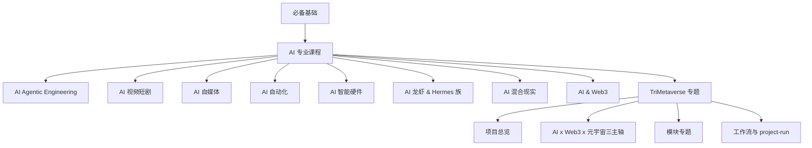

# TriTraining AI 课程图谱

## 文档同步元信息

- sourceOfTruth: TriTraining/docs/training/tritraining-ai-course-graph.md
- publishedFrom: TriTraining/docs/training/tritraining-ai-course-graph.md
- syncMode: module-source
- publishTier: module-training-course-graph
- lastSyncedAt: 2026-06-14

版本：V0.2
日期：2026-06-14
状态：TriTraining 模块课程图谱已回收

## 1. 文档定位

本文用于定义 `TriTraining` 当前阶段的 AI 课程总图谱。

目标不是今天就把所有方向全部做完，而是先把课程体系画成一张可持续扩展的图：

1. 从哪里开始学。
2. 学完基础后如何进入专业课程。
3. 专业课程之后如何分流到不同方向。
4. 每个方向内部自己的课程体系应该怎么长。
5. 当前已经做的零散课程该挂到哪里。

## 2. 总体判断

当前最稳妥的课程图谱，不应从“模块清单”直接开始，而应从学习者视角开始。

因此，顶层采用三段式：

1. `必备基础`
2. `AI 专业课程`
3. `方向课程簇`

其中：

- `必备基础` 解决“所有人都应该先具备什么”。
- `AI 专业课程` 解决“进入任何专业方向前共同需要的工程与方法能力”。
- `方向课程簇` 解决“进入具体方向后，课程如何继续扩展”。

## 3. 课程图谱（总图）

## 4. 起始节点：必备基础

`必备基础` 是整个图谱的统一起点，当前建议至少包含 6 条主线：

1. 计算机与网络最小常识
2. Python / JavaScript / 命令行基础
3. API、JSON、文件、路径与配置基础
4. Git / 文档 / 版本 / 结构化记录基础
5. AI 基础概念：模型、prompt、上下文、工具、agent、workflow
6. Web3 与元宇宙最小概念：身份、钱包、链上 / 链下、数字世界语义

这一层不追求专业深度，目标是让学习者拥有进入后续任何方向的最小共同语言。

## 5. 第二层：AI 专业课程

`AI 专业课程` 是所有方向共享的“专业共同层”，建议先分成 6 个课程簇：

1. AI 工程基础：环境、依赖、配置、接口、部署基础
2. AI 产品与项目基础：需求、MVP、验证、迭代、项目约束
3. AI 数据与内容流基础：输入、输出、处理、评估、回写
4. Agent / Workflow 基础：agent、tool、memory、planner、state machine
5. 代码阅读与系统拆解：入口、调用链、关键对象、配置流、状态流
6. 评估与交付基础：测试、验证、回归、风险、发布、运行边界

当前已经完成的两门课程，最适合挂在这里的：

- `AI 专业课程 -> Agent / Workflow 基础 -> CLI / source-publish-live-runtime 链路`
- 其中 `Employee Source Kit CLI` 负责 source scaffold / validate 的上游入口
- `Employee Host Publish 发布链` 负责 source -> support -> binding profile 的下游发布链

## 6. 方向课程簇（动态可扩展）

### 6.1 AI Agentic Engineering

这是当前最适合率先做深的主方向之一。

建议课程架构：

1. 基础层：agent、tool、memory、workflow、state、contract
2. 工程层：CLI、API、scheduler、runtime、sandbox、evaluation
3. 系统层：多 agent 协作、project-run、phase engine、proof/evidence
4. 实战层：以真实项目和真实代码链路做 project-run

当前已落课程：

1. `Employee Source Kit CLI` 课程
2. `Employee Source Kit CLI` 实验手册
3. `Employee Host Publish 发布链` 课程
4. `Employee Host Publish 发布链` 实验手册

### 6.2 AI 视频短剧

建议课程架构：

1. 内容表达基础：剧情、分镜、角色、镜头节奏
2. 生产链路：文案 -> 配音 -> 画面 -> 剪辑 -> 发布
3. 工具链：脚本生成、口播、图像 / 视频生成、后期工具
4. 商业链：内容定位、转化路径、投放与回收

### 6.3 AI 自媒体

建议课程架构：

1. 账号定位与内容主题
2. 爆款结构、选题与节奏
3. 多平台分发与内容工厂
4. 数据复盘、商业化和自动化增长

### 6.4 AI 自动化

建议课程架构：

1. 自动化基础：表单、脚本、API、RPA、任务编排
2. 工作流自动化：办公、报税、运营、销售、客服
3. 智能自动化：agent + workflow + human-in-the-loop
4. 企业化：权限、审计、回滚、成本与稳定性

### 6.5 AI 智能硬件

建议课程架构：

1. 硬件与传感器基础
2. AI 控制与边缘执行
3. 机器人 / 无人机 / 设备自动化场景
4. 云边协同与真实部署

### 6.6 AI 龙虾 & Hermes 族

这是方法论、项目吸收链和系统演进方向。

建议课程架构：

1. OpenClaw / Hermes / Super-dev 等方法与骨架解读
2. 吸收链：reference -> vendor -> real implementation
3. host / runtime / memory / workflow 的系统演进
4. TriCompany / TriDev / TriMC 里的真实吸收案例

### 6.7 AI 混合现实

建议课程架构：

1. XR / MR 基础概念与产品形态
2. AI 与 3D / 空间交互的结合
3. 数字分身、数字空间、实时交互
4. 与元宇宙平台和训练空间的结合

### 6.8 AI & Web3

建议课程架构：

1. Web3 基础：钱包、身份、链上 / 链下
2. AI 与 Web3 的身份、凭证、治理与收益回路
3. 合规边界、公益基金会边界与当前不做项
4. 真实项目中的链上协作与训练平台扩展面

### 6.9 TriMetaverse 专题

`TriMetaverse` 应单独作为一条旗舰课程主线，而不是被分散吞进其他方向里。

原因是它本身既是：

1. 一个项目
2. 一套模块群
3. 一条 AI / Web3 / 元宇宙交叉实践主线
4. 一套真实课程素材来源

## 7. TriMetaverse 专题课程体系架构

当前判断：`TriMetaverse` 课程体系不应只按模块，也不应只按 `AI + Web3 + 元宇宙` 三个概念域来组织；最稳妥的是“混合式架构”。

推荐分成 4 层：

1. 项目总览层：世界观、目标、边界、主线与当前阶段
2. 三主轴理解层：AI、AI & Web3、AI & 元宇宙
3. 模块专题层：TriCompany、TriAvatar、TriStaciss、TriMC、TriLC、TriPilot、TriDev 等
4. 工作流实战层：source -> publish -> live -> runtime、project-run、IPD、phase engine

这意味着：

- 学习者先知道这个项目是什么。
- 再知道它为什么是 AI / Web3 / 元宇宙交叉项目。
- 再进入模块专题。
- 最后进入真实工作流与 project-run。

## 8. 当前小课程如何接入体系

`Employee Source Kit CLI` 与 `Employee Host Publish 发布链` 这两门小课当前都应该双挂接：

### 8.1 主挂接

- `必备基础 -> AI 专业课程 -> AI Agentic Engineering -> CLI / source-publish-live-runtime`

### 8.2 交叉挂接

- `TriMetaverse 专题 -> 模块专题 -> TriCompany / source-publish-live-runtime`

其中：

- `Employee Source Kit CLI` 负责 source scaffold / validate 的第一跳
- `Employee Host Publish 发布链` 负责 support payload、manifest 和 binding profile 的第二跳

这样它们既是专业工程课，又是 `TriMetaverse` 真实案例课。

## 9. 后续渐进式构建规则

后续所有零散课程，统一按以下方式接入：

1. 先判断它属于 `必备基础`、`AI 专业课程` 还是某个方向簇。
2. 若它同时是 `TriMetaverse` 的真实案例，再给它一条 `TriMetaverse 专题` 交叉挂接。
3. 每门课至少要有：课程稿、实验手册、lesson contract、lab contract。
4. 所有涉及现役代码模块的课程，默认先用 `CodeGraph` 组织入口和调用链，再写课程。

## 10. 当前下一步

当前最自然的继续动作是：

1. 继续补第三门 `source -> publish -> live -> runtime` 总览课。
2. 沿 `TriMetaverse 专题` 的四层架构继续补模块专题和 project-run 课。
3. 为其他方向逐步补第一批课程，不急于一次写满。
